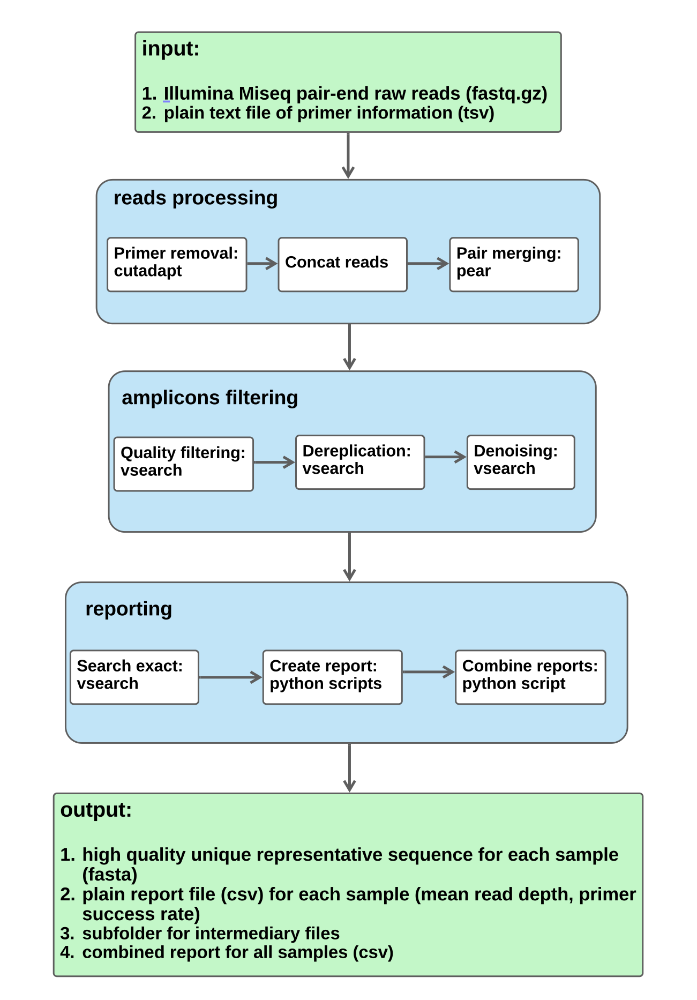

# Step-mothur
## Introduction
**Step-mothur** is a bioinformatics analysis pipeline used for initial quality control, denoising of highly-multiplexed amplicon sequencing (HMAS) data. Currently, only the pair-end Illumina data is supported.  
The pipeline is built using [nextflow](https://www.nextflow.io/), a workflow tool to help with processing multiple samples in parallel and allowing for highly modular, customizable, and scalable analysis of HMAS data.  
 

## Pipeline summary  
By default, the pipeline runs the following [workflow](#workflow):  

- Input: Illumina Miseq pair-end raw reads (fastq.gz format) for each sample, all in a single folder, and a plain file (4 columns, tab delimited) of primer information.  
- Primer removal ([cutadapt](https://cutadapt.readthedocs.io/en/stable/installation.html))  
- Pair merging ([pear](https://www.h-its.org/downloads/pear-academic/))  
- Quality filtering ([vsearch](https://github.com/torognes/vsearch))  
- Dereplication (vsearch)  
- Denoising (vsearch)  
- Reporting (custom scripts)
- Output: high quality unique representative sequence file (fasta format), and a plain text file report. Additionally, there is the combined report summarizing the data from all samples.    

## Installation  

1. Copy the Github repository to a folder  
`git clone https://github.com/ncezid-biome/HMAS-QC-Pipeline2.git`   

2.  We recommend using conda for all required dependencies. You can create a conda env with our provided yaml file. For that, you will run the following:   
    -  `conda env create -n hmas -f bin/hmas.yaml` (or `mamba env create -n hmas -f bin/hmas.yaml` for speed)   
    -   `conda activate hmas`  

## USAGE

 1. **Test with the default test_data**:  
 Run the following: `nextflow run hmas2.nf -profile test`  
 Depends on your hardware, the test run should be completed in a few minutes. And the output will be in the `test_output` folder  

2. **Test with your own data** - Make sure to provide path for the 3 required parameters in **nextflow.config** file.    

    -  **params.reads**: this is the path to your paired demultiplexed fastq files (for each sample). And make sure they have a `*_R{1,2}*.fastq.gz` pattern.  
    -  **params.outdir**: this is the folder for your output which contains all the subfolders (one for each sample).   
    -  **params.primer**: this is the path (***absolute path recommended***) to your primer-pair file which lists your primer infomation, and it's 4 column (tab delimited) file with the format as: 'primer', forward_primer, reverse complement of reverse_primer and primer name, i.e.,  `primer  CACGCATCATTTCGCAAAAGC   AGTACGTTCGGCCTCTTTCAG   OG0001079primerGroup1`    

    **Run the following**:  
    `nextflow run hmas2.nf`    

    **note:** the alternative is to provide those 3 parameters at the command line, for example:  
 `nextflow run hmas2.nf --reads YOUR_READS --outdir YOUR_OUTPUT --primer YOUR_PRIMER`  

3. **nextflow.config file**:  
Feel free to update the file as necessary. But it is recommended to fill in the `params.reads, params.outdir, params.primer`, update the `CPU, memory, params.maxcutadapts` parameters based on your available hardware, and leave other parameters intact unless you have strong evidence to update them otherwise.

   

## Workflow 

  

**note:** 
1. the optional count table contains abundance information for the corresponding high quality unique sequences (fasta file). It is only optional because the abundance information is also embedded in the seq_ID in the fasta file. For example, size=551 is the abundance value for this particular sequence.    `>M03235:107:000000000-KPP6Y:1:1101:19825:4748=OG0001064primerGroup7=isolateD-3-M3235-23-014;size=551`   