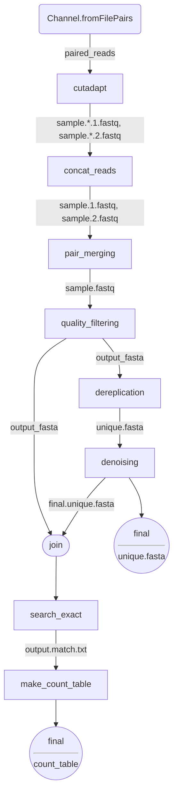

# HMAS-QC-Pipeline2 (sample based)

An alternative pipeline for doing initial quality control of highly-multiplexed amplicon sequencing data.

 [the original HMAS QC Pipeline](https://github.com/ncezid-biome/HMAS-QC-Pipeline)

## TOC
* [Description](#description)
* [Requirements](#requirements)
* [INSTALL](#install)
* [USAGE](#usage)
* [Workflow](#workflow)  

## Description

This is a pipeline that performs quality control analysis on highly-multiplexed amplicon sequencing (HMAS) data.
The pipeline is implemented in nextflow with some python and shell scripts. The input of the pipeline is demultiplexed fastq files (gzipped or not) for each sample. If you have multiplexed fastq files, you can run bcl2fastq for demultiplexing. 
It provides 2 main outputs of interest: 

1. A **fasta** file containing the high-quality representative unique sequences after cleaning
2. A **count_table** file containing the abundance information of the above fasta file   
**note:** _this count_table file is converted to a python pickle file (.pkl) for fast loading_

For more information and to see visualizations describing the workflow, see [this folder containing visual documents](https://github.com/ncezid-biome/HMAS-QC-Pipeline2/tree/main/documents).

This pipeline has been designed and tested under Linux CentOS and Ubuntu platforms.  It has not been tested under Windows.

## Requirements

1. Python 3 or higher. Download python [here](https://www.python.org/downloads/). 

2. PEAR installed and/or on your path. Download PEAR [here](https://www.h-its.org/downloads/pear-academic/).

3. Cutadapt installed and/or on your path. Find cutadapt installation guide [here](https://cutadapt.readthedocs.io/en/stable/installation.html).

4. VSEARCH installed and/or on your path. Find more vsearch installtion guide [here](https://github.com/torognes/vsearch).

5. nextflow installed and/or on your path. Find more nextflow installation guide [here](https://www.nextflow.io/docs/latest/getstarted.html).

## INSTALL

1. Copy the Github repository to a folder  
`git clone https://github.com/ncezid-biome/HMAS-QC-Pipeline2.git` 

## USAGE

1. make sure your paired demultiplexed fastq files (for each sample) are under the **/HMAS-QC-Pipeline2/data** folder. And they have a `*_R{1,2}*.fastq.gz` patern

2. create a  **output** folder under **/HMAS-QC-Pipeline2**   
_note_: the output folder will hold the _final.unique.fasta_, _final.count_table.pkl_ and a few other intermediary files

3. If you haven't installed those required packages and if have access to Scicomp, you can module load all of them. Otherwise, you can create a conda env with our provided yaml file. For that, you will run the following:   
    1. `conda env create -n hmas -f bin/hmas.yaml` (if you have mamba installed, use `mamba env create` instead for speed)   
    2.  `conda activate hmas`  
>**Note**: We didn't use singularity container at this time because:  
> 1. I can't find some docker images (i.e. PEAR)
> 2. nextflow only allows 1 container image per process (and we need more than 1 for some processes)   
4. Run the following:  
`nextflow run hmas2.nf`    

   

## Workflow 

