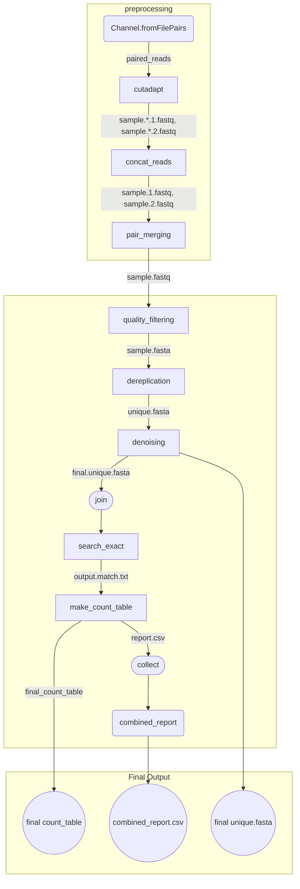

# HMAS-QC-Pipeline2 (sample based)

An alternative pipeline for doing initial quality control of highly-multiplexed amplicon sequencing data. **This sample based approach takes demultiplexed raw reads for each sample, and generates output file in a separate folder for each sample**

 [the HMAS2 QC Pipeline](https://github.com/ncezid-biome/HMAS-QC-Pipeline2/tree/main)

## TOC
* [Description](#description)
* [Requirements](#requirements)
* [INSTALL](#install)
* [USAGE](#usage)
* [Workflow](#workflow)  
* [miscellaneous](#miscellaneous)  

## Description

This is a pipeline that performs quality control analysis on highly-multiplexed amplicon sequencing (HMAS) data.
The pipeline is implemented in nextflow with some python and shell scripts. The input of the pipeline is demultiplexed fastq files (gzipped or not) for each sample. If you have multiplexed fastq files, you can run bcl2fastq for demultiplexing. 
It provides 3 main outputs of interest (**for each sample**): 

1. A **fasta** file containing the high-quality representative unique sequences after cleaning
2. A **count_table** file containing the abundance information of the above fasta file   
~~**note:** _this count_table file is converted to a python pickle file (.pkl) for fast loading_~~  
**note:** _this count_table is becoming obsolete because we now embedded abundance information  in the seq_ID in the above fasta file. For example (size=551 is the abundance value for this particular sequence):_    
`>M03235:107:000000000-KPP6Y:1:1101:19825:4748=OG0001064primerGroup7=isolateD-3-M3235-23-014;size=551`  
3. A csv report file containing the statistics (mean read depth, successful primer counts, etc.) of the reads for this sample

For more information and to see visualizations describing the workflow, see [this folder containing visual documents](https://github.com/ncezid-biome/HMAS-QC-Pipeline2/tree/main/documents).

This pipeline has been designed and tested under Linux CentOS and Ubuntu platforms.  It has not been tested under Windows.

## Requirements

1. Python 3 or higher. Download python [here](https://www.python.org/downloads/). 

2. PEAR installed and/or on your path. Download PEAR [here](https://www.h-its.org/downloads/pear-academic/).

3. Cutadapt installed and/or on your path. Find cutadapt installation guide [here](https://cutadapt.readthedocs.io/en/stable/installation.html).

4. VSEARCH installed and/or on your path. Find more vsearch installtion guide [here](https://github.com/torognes/vsearch).

5. nextflow (version 22.04.3  or newer) installed and/or on your path. Find more nextflow installation guide [here](https://www.nextflow.io/docs/latest/getstarted.html).

## INSTALL

1. Copy the Github repository to a folder  
`git clone https://github.com/ncezid-biome/HMAS-QC-Pipeline2.git`   

2.  If you haven't installed those required packages, you can create a conda env with our provided yaml file. For that, you will run the following:   
    1. `conda env create -n hmas -f bin/hmas.yaml` (or `mamba env create -n hmas -f bin/hmas.yaml` instead for speed; CDC users have mamba available once they module load conda)   
    2.  `conda activate hmas`  
>**Note**: We didn't use singularity container at this time because:  
> 1. I can't find some docker images (i.e. PEAR)
> 2. nextflow only allows 1 container image per process (and we need more than 1 for some processes)  

## USAGE

 1. **Test with the default test_data**:  
 Run the following: `nextflow run hmas2.nf -profile test`  
 Depends on your hardware, the test run should be completed in a few minutes. And the output will be in the `test_output` folder  

2. **Test with your own data** - Make sure to provide path for the 3 required parameters in **nextflow.config** file.    

    1.  **params.reads**: this is the path to your paired demultiplexed fastq files (for each sample). And make sure they have a `*_R{1,2}*.fastq.gz` pattern.  
    2.  **params.outdir**: this is the folder for your output which contains all the subfolders (one for each sample). And each subfolder holds the _final.unique.fasta_, _final.count_table_, _samplename.csv_ and a few other intermediary files  
    3.  **params.primer**: this is the path to your primer-pair file which lists your primer infomation, and it's 4 column (tab delimited) file with the format as: 'primer', forward_primer, reverse complement of reverse_primer and primer name, i.e.,  `primer  CACGCATCATTTCGCAAAAGC   AGTACGTTCGGCCTCTTTCAG   OG0001079primerGroup1`

  
3. Run the following:  
`nextflow run hmas2.nf`    
**note:** if you're too lazy to provide those 3 required parameters in the **nextflow.config** file, you can still provide them at the command line, for example:  
 `nextflow run hmas2.nf --reads YOUR_READS --outdir YOUR_OUTPUT --primer YOUR_PRIMER`  

   

## Workflow 

**note:** the final.count_table and final.unique.fasta files are per sample based, while combined_report.csv is for the combined report for all the samples in the study.  

## Miscellaneous 

1.  **difference in sequence abundance distribution** (between previous mothur version and current hmas2 version)   
    - with mothur version, there is a significant peak at the very low end of sequence abundance. Please check out the visualization [this folder containing visual documents](https://github.com/ncezid-biome/HMAS-QC-Pipeline2/tree/sample_base/documents).    
    - And this difference comes from the additional **unoise_alpha** parameter in the denoising step of the hmas2 pipeline. 
    - > **alpha**: determines the threshold level of dissimilarity between frequent and infrequent reads for exclusion of infrequent reads.  
    (Denoising exploits the observation that a low-abundance sequence that is very similar to a 
high-abundance sequence is likely to be an error.)