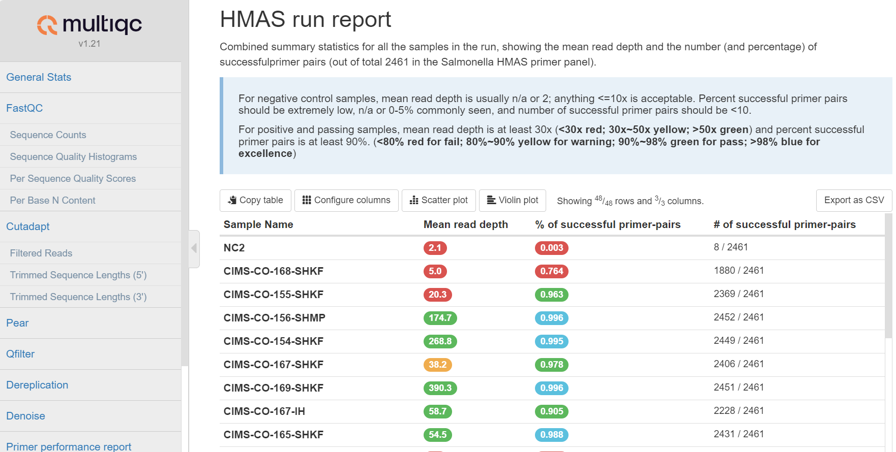

# Step-mothur
## Introduction
**Step-mothur** is a bioinformatics analysis pipeline used for initial quality control, denoising of highly-multiplexed amplicon sequencing (HMAS) data. Currently, only the pair-end Illumina data is supported.  
The pipeline is built using [nextflow](https://www.nextflow.io/), a workflow tool to help with processing multiple samples in parallel and allowing for highly modular, customizable, and scalable analysis of HMAS data.  
 

## Pipeline summary  
By default, the pipeline runs the following [workflow](#workflow):  

- Input: Illumina Miseq pair-end raw reads (fastq.gz format) for each sample, all in a single folder, and a plain file (4 columns, tab delimited) of primer information.  
- Raw reads quality control ([fastqc](https://www.bioinformatics.babraham.ac.uk/projects/fastqc/))   
- Primer removal ([cutadapt](https://cutadapt.readthedocs.io/en/stable/installation.html))  
- Pair merging ([pear](https://www.h-its.org/downloads/pear-academic/))  
- Quality filtering ([vsearch](https://github.com/torognes/vsearch))  
- Dereplication (vsearch)  
- Denoising (vsearch)  
- Reporting (custom scripts)
- Aggregate reports ([multqic](https://multiqc.info/))  
- Output: high quality unique representative sequence file (fasta format), and a plain text file report. Additionally, there is a combined report (csv format) summarizing the data from all samples and a MultiQC report (html format) aggregating data from all the modules.   

## Installation  

1. Copy the Github repository to a folder  
`git clone https://github.com/ncezid-biome/HMAS-QC-Pipeline2.git`   

2.  We recommend using conda for all required dependencies. You can create a conda env with our provided yaml file. For that, you will run the following:   
    -  `conda env create -n hmas -f bin/hmas.yaml` (or `mamba env create -n hmas -f bin/hmas.yaml` for speed)   
    -   `conda activate hmas`  

## USAGE

 1. **Test with the default test_data**:  
     - Run the following: `nextflow run hmas2.nf -profile test`  
 Depends on your hardware, the test run should be completed in a few minutes. And the output will be in the `test_output` folder  
     - Alternatively, change directory to the **test_data** folder, and run the following: `./test_pipeline.sh`  
     The script will automatically run the pipeline with the default test data and compare the output to the expected result and print out **'PASSED ! CSV files match'** if the results match, or **WARNING messages** otherwise.  

2. **Test with your own data** - Make sure to provide path for the 3 required parameters in **nextflow.config** file.    

    -  **params.reads**: this is the path to your paired demultiplexed fastq files (for each sample). And make sure they have a `*_R{1,2}*.fastq.gz` pattern.  
    -  **params.outdir**: this is the folder for your output which contains all the subfolders (one for each sample).   
    -  **params.primer**: this is the path (***absolute path required***, append it with $PWD/ if it's in the same work directory of the hmas2.nf file) to your primer-pair file which lists your primer infomation, and it's 4 column (tab delimited) file with the format as: 'primer', forward_primer, **_reverse complement of reverse_primer_** and primer name, i.e.,  `primer  CACGCATCATTTCGCAAAAGC   AGTACGTTCGGCCTCTTTCAG   OG0001079primerGroup1`    

    **Run the following**:  
    `nextflow run hmas2.nf`    

    **note:** the alternative is to provide those 3 parameters at the command line, for example:  
 `nextflow run hmas2.nf --reads YOUR_READS --outdir YOUR_OUTPUT --primer YOUR_PRIMER`  

3. **nextflow.config file**:  
Feel free to update the file as necessary. But it is recommended to fill in the `params.reads, params.outdir, params.primer`, update the `CPU, memory, params.maxcutadapts` parameters based on your available hardware, and leave other parameters intact unless you have strong evidence to update them otherwise.  

4.  **multiqc_config.yaml file in bin/ folder**:  
Feel free to update the file as necessary. This file controls the display in the MultiQC htmal report.  

   

## Workflow 

  

**note:** 
1. the optional count table contains abundance information for the corresponding high quality unique sequences (fasta file). It is only optional because the abundance information is also embedded in the seq_ID in the fasta file. For example, size=551 is the abundance value for this particular sequence.    `>M03235:107:000000000-KPP6Y:1:1101:19825:4748=OG0001064primerGroup7=isolateD-3-M3235-23-014;size=551`

## Notices

### Public Domain Notice
This repository constitutes a work of the United States Government and is not
subject to domestic copyright protection under 17 USC § 105. This repository is in
the public domain within the United States, and copyright and related rights in
the work worldwide are waived through the [CC0 1.0 Universal public domain dedication](https://creativecommons.org/publicdomain/zero/1.0/).
All contributions to this repository will be released under the CC0 dedication. By
submitting a pull request you are agreeing to comply with this waiver of
copyright interest. 

### License Standard Notice

### Privacy Notice
This repository contains only non-sensitive, publicly available data and
information. All material and community participation is covered by the
[Disclaimer](https://github.com/CDCgov/template/blob/master/DISCLAIMER.md)
and [Code of Conduct](https://github.com/CDCgov/template/blob/master/code-of-conduct.md).
For more information about CDC's privacy policy, please visit [http://www.cdc.gov/other/privacy.html](https://www.cdc.gov/other/privacy.html).

### Contributing Notice
Anyone is encouraged to contribute to the repository by [forking](https://help.github.com/articles/fork-a-repo)
and submitting a pull request. (If you are new to GitHub, you might start with a
[basic tutorial](https://help.github.com/articles/set-up-git).) By contributing
to this project, you grant a world-wide, royalty-free, perpetual, irrevocable,
non-exclusive, transferable license to all users under the terms of the
[Apache Software License v2](http://www.apache.org/licenses/LICENSE-2.0.html) or
later.

All comments, messages, pull requests, and other submissions received through
CDC including this GitHub page may be subject to applicable federal law, including but not limited to the Federal Records Act, and may be archived. Learn more at [http://www.cdc.gov/other/privacy.html](http://www.cdc.gov/other/privacy.html).  

If you're interested in contributing, please read our [CONTRIBUTING guide](/CONTRIBUTING.md).  

### Records Management Notice
This repository is not a source of government records, but is a copy to increase
collaboration and collaborative potential. All government records will be
published through the [CDC web site](http://www.cdc.gov). 
