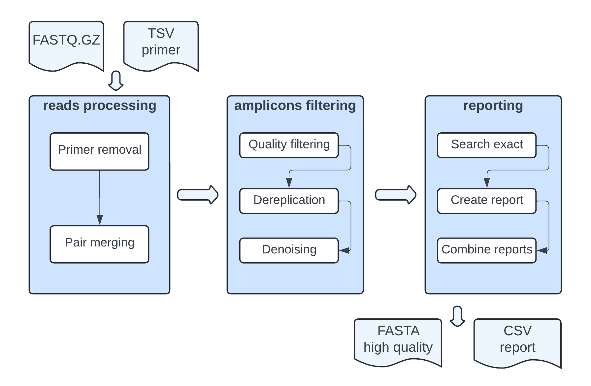

# Summary

Highly multiplexed amplicon sequencing (HMAS) is a potentially cost-effective and scalable method to detect genetic clusters and potential outbreaks of enteric pathogens directly from stool, without isolating a bacterial culture. We developed an automated HMAS data quality control pipeline by combining multiple off-the-shelf bioinformatic tools - including cutadapt, PEAR, vsearch and customized Python and shell scripts - through Nextflow. Software dependencies are distributed through a Conda environment. Notably, our pipeline, Step-mothur, is specifically designed to handle numerous amplicons by leveraging the innate parallel processing capabilities offered by Nextflow.  

# Statement of need

Targeted next-generation sequencing (NGS) methods, like 16S amplicon sequencing, provide a cost-effective and efficient means of characterizing organisms in metagenomic samples by focusing on specific regions of interest rather than deep sequencing samples for metagenome assembly or isolating individual organisms prior to sequencing. Several laboratory techniques now make it possible to easily expand the number of simultaneously amplified targets into the hundreds or thousands, a class of techniques we refer to as highly multiplexed amplicon sequencing (HMAS). However, unlike 16S taxonomic analysis, HMAS users have not benefited from easily accessible, off-the-shelf pipelines, such as mothur [@Schloss:2009] and QIIME2 [@Bolyen:2019]. To help meet this need, we developed Step-mothur, a Nextflow-based quality control pipeline that builds upon the techniques pioneered by 16S taxonomic analysis and adheres to well-established principles within the targeted NGS field. Notably, Step-mothur is optimized for efficient analysis of thousands of targets per sample from HMAS data, whereas mothur and QIIME2 are best suited to small numbers of amplicon targets.   

# Materials and Methods
## Workflow
Figure 1 depicts the workflow:  
1. Input.  Required files include Illumina Miseq pair-end raw reads (fastq.gz format) for each sample, all in a single folder, and a plain text file of primer information. To generate the example input data, the Juno microfluidic thermocycler from Standard BioTools was used to amplify 2461 Salmonella cgMLST primer pairs into amplicon libraries. These libraries were subsequently sequenced on an Illumina MiSeq platform (2x250 reads, v2 chemistry).    
2. Primer removal.  Remove primer sequences with cutadapt [@Martin:2011]. Users can adjust error tolerance, as well as other settings depending on amplicon design (e.g., if reads can be longer than amplicons).      
3. Pair merging.  The pipeline uses PEAR [@Zhang:2014] to merge reads. Users can set different threshold value in the configuration file.   
4. Quality filtering.  The pipeline uses vsearch [@Rognes:2016] to remove sequences that contain sequencing errors, based on the quality scores in the original fastq file. After this step, fastq files are converted to fasta files.   
5. Dereplication.  The pipeline uses vsearch [@Rognes:2016] to extract all the unique sequences that are represented in the reads.   
6. Denoising.   The denoising algorithms in the pipeline leverage read frequency and sequence composition to identify probable sequencing errors. Specifically, the UNOISE3 algorithm [@Edgar:2016] implemented in vsearch [@Rognes:2016] is utilized for denoising purposes.   
7. Reporting.  The pipeline executes a customized Python script to generate individual plain text file reports for each sample. These reports contain essential information such as the mean read depth and primer success rate, in addition to a combined report summarizing the data from all samples.     
8. Output.  An output folder is generated for each sample, containing 2 files and 1 subfolder: a high quality unique representative sequence file (fasta format), a plain text file report, and one subfolder for storing intermediary files. Optionally, there are also a sequence abundance information file (mothur full format count file). Additionally, there is the combined report summarizing the data from all samples.    

## Configuration file
A single configuration file containing all the pipeline options and parameters is provided. Users have the flexibility to adjust threshold values within each process, fine-tuning the pipeline's behavior to meet their requirements. Additionally, the configuration file allows customization of pipeline parameters based on the available hardware resources, enabling efficient utilization of computing capabilities.   

# Conclusions  
The Step-mothur pipeline offers a streamlined solution for the analysis of HMAS data, aiming to generate high quality sequences. It is specifically designed to handle multiple samples with many targets per sample, utilizing innate parallelization mechanism of Nextflow. Notably, Step-mothur outperforms mothur in terms of efficiency with HMAS data, with a shorter processing time of 5 hours compared to 20 hours. It leverages the Nextflow framework to provide a user-friendly and reproducible workflow, with the added benefit of easy extension for incorporating further downstream processes. Moreover, being purpose-built, the Step-mothur pipeline ensures maintainability and ease of troubleshooting.     

# Acknowledgements
This work was made possible through support from the Office of Advanced Molecular Detection at the CDC. This project was supported, in part, by an appointment to the Research Participation Program at the CDC administered by the Oak Ridge Institute for Science and Education through an interagency agreement between the U.S. Department of Energy and the CDC. The findings and conclusions in this presentation are those of the authors and do not necessarily represent the views of the Centers for Disease Control and Prevention. Use of trade names is for identification only and does not imply endorsement by the Centers for Disease Control and Prevention or by the U.S. Department of Health and Human Services. Lastly, Step-mothur draws inspiration from mothur [@Schloss:2009].   

# References