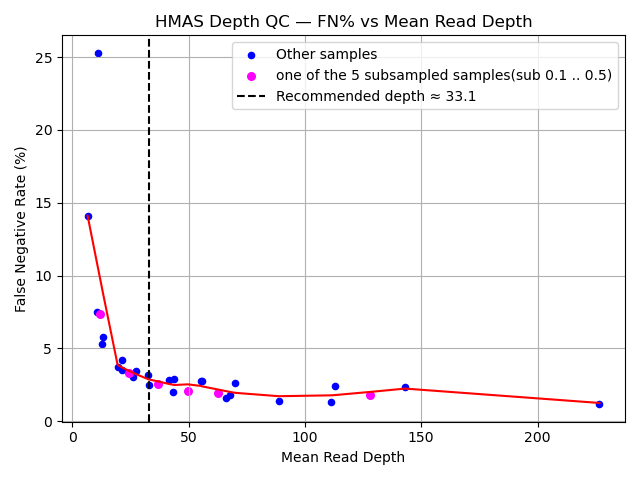

# 30x Mean Read Depth Threshold 

Traditional ROC/AUC analysis is not informative in this setting because there are very few negative primers. In our assay, most primers are expected to generate amplicons based on in silico design, resulting in an extreme class imbalance and very few true negatives. Under these conditions, ROC curves and AUC values are unstable and difficult to interpret.

Instead, we focus on **false negative rate (FN%)** as a function of mean read depth, which directly reflects primer recovery sensitivity.

## Data Used

- **6 isolate samples** from the same sequencing run  
- **5 samples** were subsampled at rates 0.1–0.5, spanning mean read depths from 67 to 226  
- **1 sample** was not subsampled (mean read depth ≈ 11)  
- **31 total sample points** used in the FN% vs mean read depth analysis  

## Recommended Depth Determination

FN% is plotted against mean read depth and smoothed using **LOWESS** to identify a performance plateau.

The **recommended depth** is defined as:

> **The smallest mean read depth at which the FN% curve reaches a stable plateau, such that additional sequencing depth yields only marginal reductions in FN%.**

Operationally, this is determined by:

1. Modeling the FN% vs. mean read depth relationship using subsampled datasets.  
2. Identifying the plateau region where the slope of FN% reduction with increasing depth becomes shallow.  
3. Selecting the **leftmost depth within this plateau**, with a small slack factor applied to avoid overfitting to local noise.  
4. Reporting this depth as the **recommended depth**, balancing primer recovery sensitivity and sequencing efficiency.

Using this approach, the recommended minimum read depth was estimated to be **~33.1×**, beyond which additional sequencing provides diminishing reductions in FN%.

### FN% vs. Mean Read Depth Plot

  

**Figure X. False negative rate (FN%) as a function of mean read depth.**  
FN% was calculated across subsampled datasets and plotted against mean read depth. The curve was smoothed using LOWESS to reduce local noise and highlight global trends in primer recovery performance. The plateau region indicates diminishing reductions in FN% with increasing sequencing depth. The leftmost depth within this plateau, was selected as the recommended minimum read depth for robust primer recovery.

## Interpretation Relative to the 30× QC Depth Threshold

Although the empirically derived recommended depth is **~33.1×**, a **30× mean read depth threshold** is used in routine quality control reporting.

This distinction reflects both analytical optimization and practical considerations:

- The **~33.1× value** represents an analytically derived optimum based on FN% plateau detection.  
- The **30× threshold** is a rounded, conservative standard that has been applied consistently across HMAS datasets and has demonstrated reliable performance in practice.  
- Empirical evaluation of HMAS data over time indicates minimal differences in primer recovery between 30× and the plateau region identified by the FN% analysis.

Accordingly, the recommended depth of ~33× should be interpreted as a **reference point for sequencing depth optimization**, rather than a rigid cutoff. While 30× remains an acceptable QC threshold for typical HMAS data, users are encouraged to apply discretion and consider dataset-specific characteristics when determining depth requirements for different experimental or analytical contexts.

# The 90% Primer Success Threshold

- In addition to depth-based threshold, a **90% primer success threshold** was applied as a quality control criterion.  
- This threshold was empirically derived through evaluation across multiple independent datasets and was selected to ensure robust locus recovery and analytical consistency in highly multiplexed amplicon sequencing experiments.  
- The chosen cutoff is deliberately more stringent than the **85% locus reporting threshold** commonly used in PulseNet core genome MLST (cgMLST) analyses.  
- Adoption of this higher threshold improves confidence in downstream comparative and phylogenetic analyses while maintaining compatibility with established public health surveillance standards [Leeper, Molly M et al. “Validation of Core and Whole-Genome Multi-Locus Sequence Typing Schemes for Shiga-Toxin-Producing E. coli (STEC) Outbreak Detection in a National Surveillance Network, PulseNet 2.0, USA.” Microorganisms vol. 13,6 1310. 4 Jun. 2025, doi:10.3390/microorganisms13061310].
